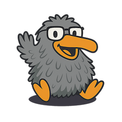

# 🏙️ QodeTopia – Java lernen mit echten Projekten und Emil

 

Willkommen bei **QodeTopia** – einer Community-basierten Lernplattform rund um **Java**.

## Unsere Mission

Wir glauben: Programmieren lernt man nicht mit Theorie allein, sondern **indem man eigene Ideen umsetzt und Dinge ausprobiert** – ohne sich in Details zu verlieren.“

Das erwartet dich:
- praktische Coding-Challenges
- echte Projekte
- Tools & Basics – erklärt mit Struktur, Humor und dem sarkastischen Sidekick **Emil**, dem Plüschvogel.

Wichtige Links:
 - YouTube: https://youtube.com/@QodeTopia
 - Discord: https://discord.com/invite/8R2HWjanQp
 - Email: `emil@open-email.de` oder `qodetopia@gmail.com`

---

## Repositories

Um dir etwas Orientierung zu geben, hier ein kleiner Auszug aus den Repositories.

- `cs_*`: Coding Challenges (einfach, fokussiert)
- `.github`: Organisationstemplates, Vorlagen
- `qodetopia.de`: Repository für die webseite (in Beabeitung)
- *(bald mehr)*

> Die Challenges sind **minimalistisch aufgebaut**: kein Maven, kein Buildsystem – nur Java & Neugier.

---

## Wer ist eigentlich Emil?

Das ist Emil, unser Co-Host und Plüschvogel mit viel Meinung.  
Er stellt die dummen Fragen, damit du dich nicht blöd fühlen musst.  
Er meckert, wenn ~~dein~~ mein Code doof ist – und feiert, wenn’s klappt.

---

## Du willst mitmachen?

- Starte eine Challenge, löse sie und teile deine Lösung
- Stell Fragen per GitHub-Issue oder auf Discord
- Mach einen Pull Request (z.B. neue Challenge, Doku-Verbesserung, Bugfix)
- Oder schreib Emil direkt: `emil@open-email.de`

> [!NOTE]
> Wir freuen uns über jede Beteiligung – besonders auf kreative Umsetzungen und schrägen Code, über den Emil sich aufregen kann.

--- 

© 2025-2025 Markus von Rüden / QodeTopia  
[[Impressum und Datenschutz](https://qodetopiade.netlify.app/impressum.html)]